## Name: Louis Silvestro
### Lab 1
a. A github account and repository for the labs was set up after reading the tutorials

b. Link to bio page: https://github.com/lsilvestro96/csci2963-labs/blob/master/bio.md

c. Reading assignments
  1. The 10 criteria of Open Source Definition are important because they ensure that open source software
	is freely available to everyone to use and modify for any purpose. These principles also help foster
	innovation by permitting that all changes to the original work are free to be modified further and distributed, which preserves the free nature of open source projects.
	
  2.  Suggestions for answering questions in a helpful way:
	 1. When suggesting a different method of completing a goal, make sure that solution fits the needs
        of the person with the problem. Even if your solution seems like the most reasonable one, the
        solution might not be plausible for the person asking the question because of their skill level
        or amount of resources.
  	 2. Make sure your answer is clear and precise, so that it is easily understood by the person asking the
        question. The answer should also be tailored to the skill level of the person with the issue, so 
        that they have a clear understanding of how to approach the problem.

d. Linux
  1. Using various commands such as cd, ls, and chmod 
     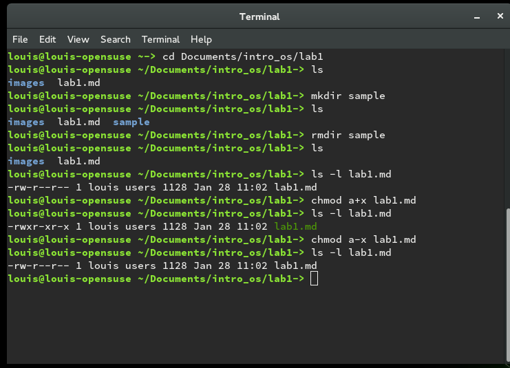

  2. Using grep to find patterns in files and outputs
	 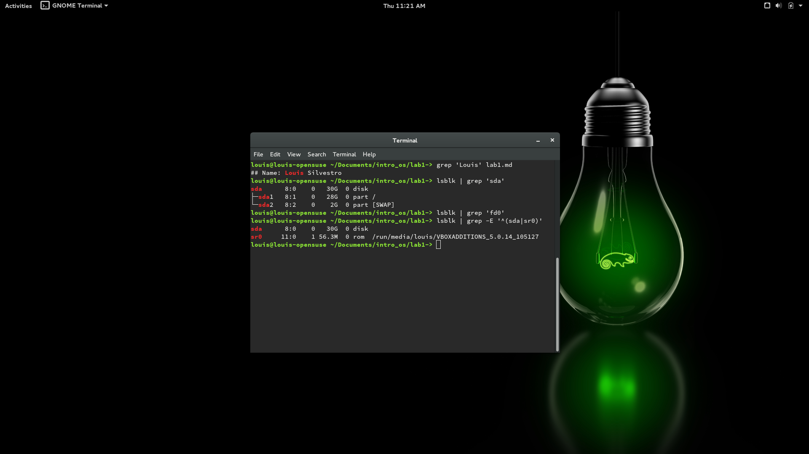
 
  3. Using tree to look at the working directory structure
     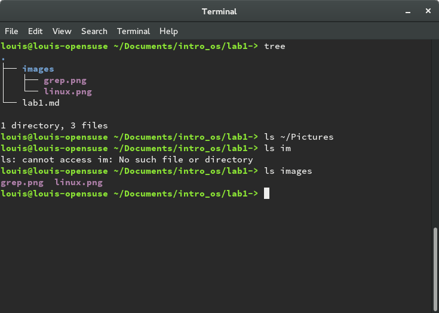

e. Regex
  1. Practice problems
    1. problem 1 
	   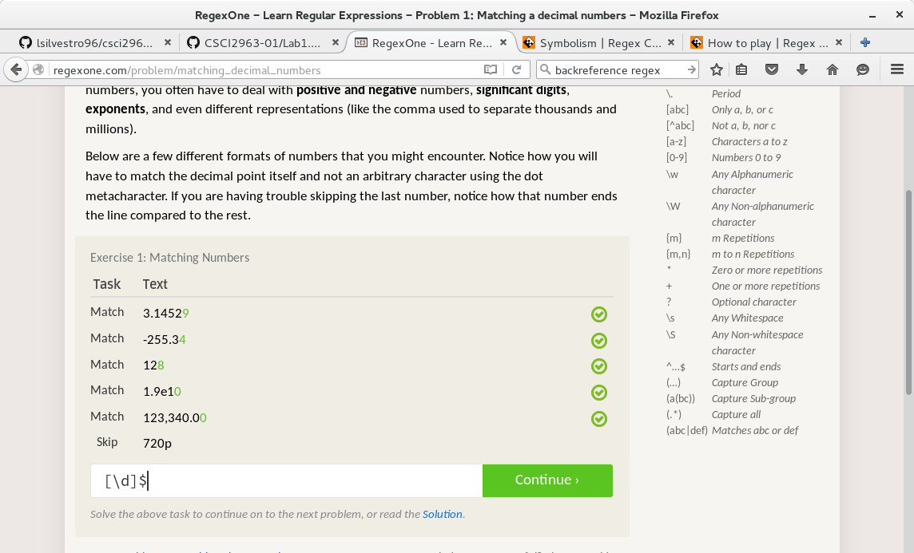
	2. problem 2
	   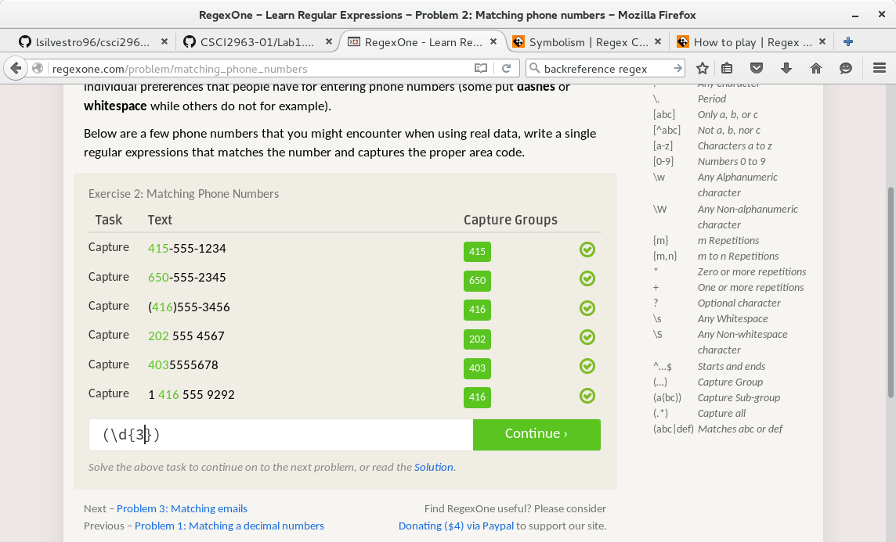
	3. problem 3
	   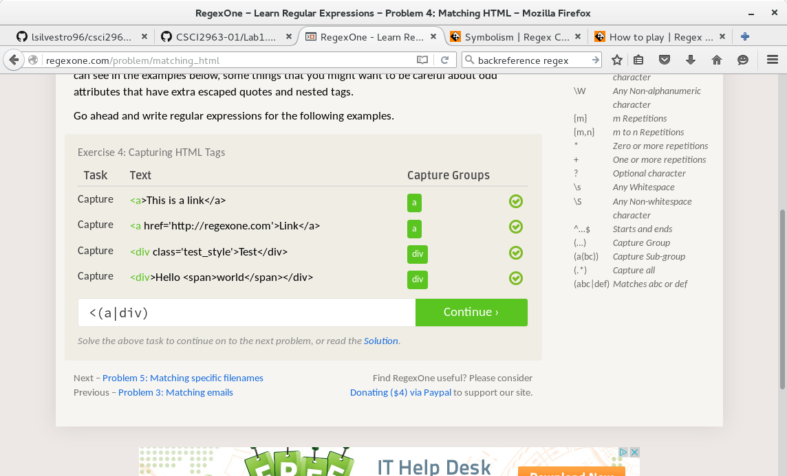
	4. problem 4
	   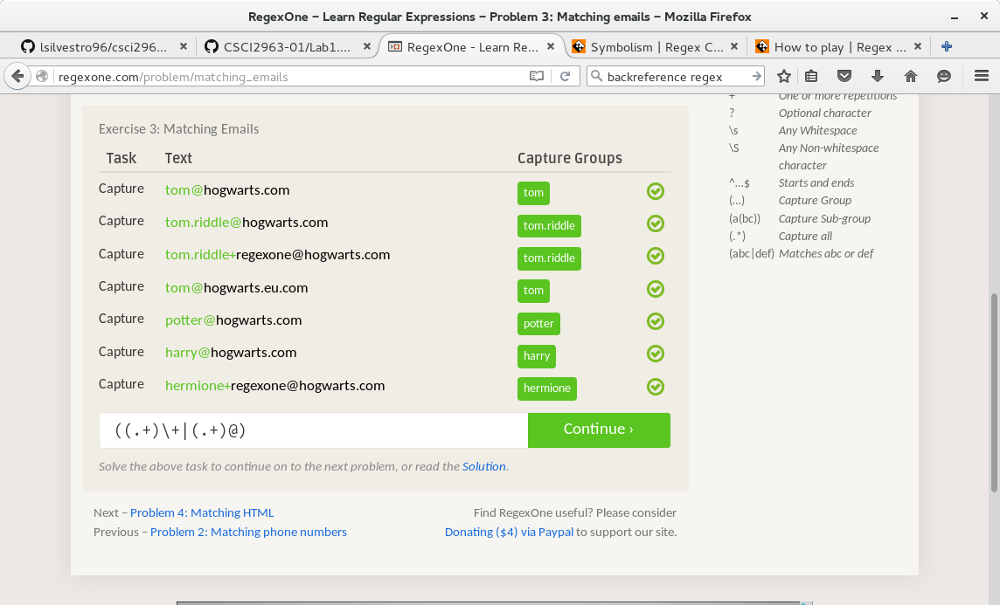
	5. problem 5
	   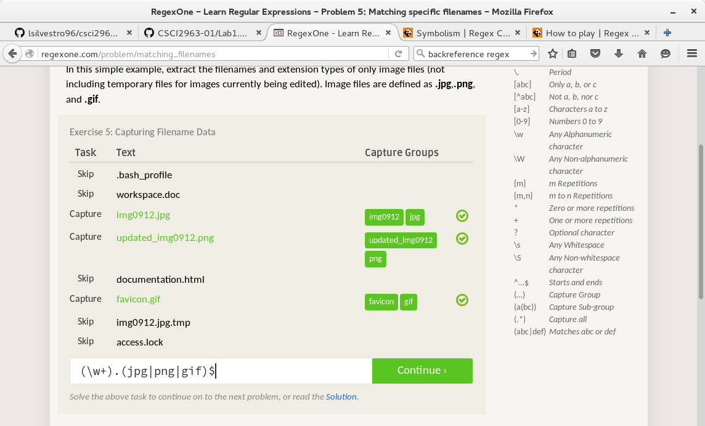
	6. problem 6
	   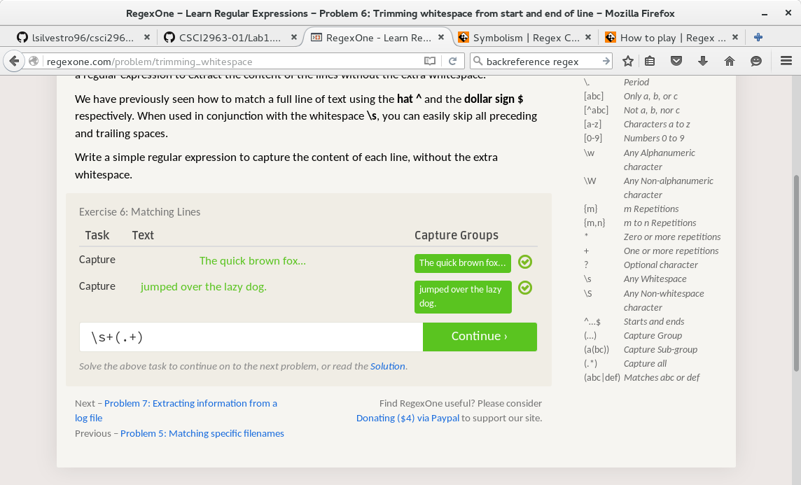
	7. problem 7
	   
  2. crossword
     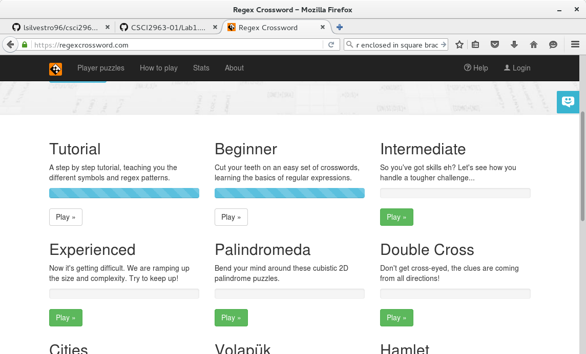

f. Completed Blocky exercise:
  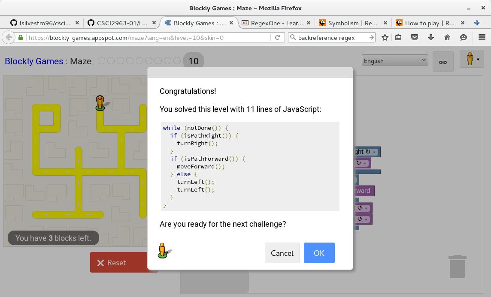

g. A project that I am interested in is creating an open source podcast manager for Windows desktop. There are many different options for managing podcasts on mobile platforms,
   but for desktop users, there are not as many choices. This project will probably be written in c++, since I know this language very well, and it will facilitate porting the program
   to a different desktop platform if I decide to support other operating systems. Features of the application will most likely include a way to manage and subscribe to new podcasts, listen to
   shows by either streaming the content or storing it offline, and a way to search for and discover new podcasts. In addition, it will feature an intuitive and well-designed interface, so that
   content can be accessed easily and quickly.
