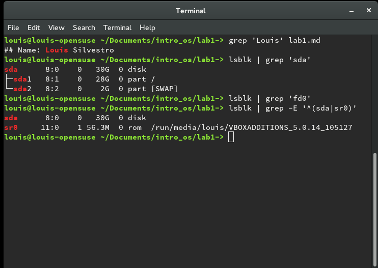

## Name: Louis Silvestro
### Lab 1
3. The 10 criteria of Open Source Definition are important because they ensure that open source software
   is freely available to everyone to use and modify for any purpose. These principles also help foster 
   innovation by requiring that all changes to the original work are free to be modified further and dist   ributed, which preserves the free nature of open source projects.

4. 
  1. When suggesting a different method of completing a goal, make sure that solution fits the needs
     of the person with the problem. Even if your solution seems like the most reasonable one, the
     solution might not be plausible for the person asking the question because of their skill level
     or amount of resources.
  2. Make sure your answer is clear and precise, so that it is easily understood by the person asking the
     question. The answer should also be tailored to the skill level of the person with the issue, so 
     that they have a clear understanding of how to approach the problem.

5. Using various commands such as cd, ls, and chmod 

6. Using grep to find patterns in files and outputs

