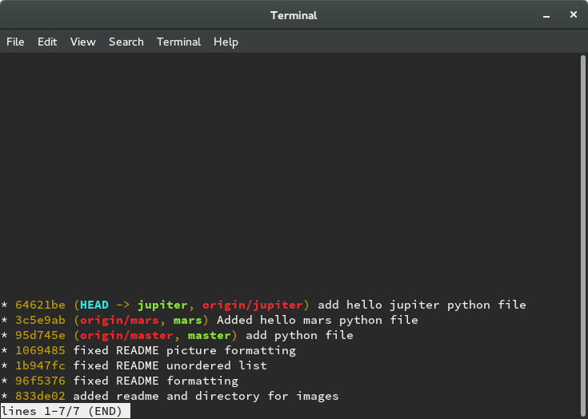
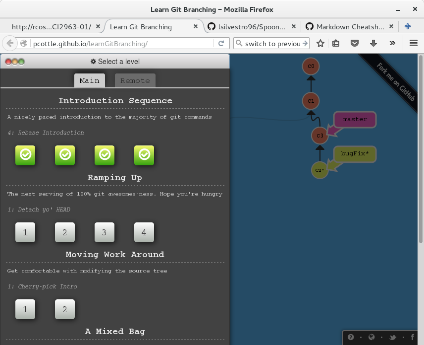

##Lab 3
Part 1:
Repository link: https://github.com/lsilvestro96/lab3part1

gitk:  

git log: 

Part 2:
Link to forked repository: https://github.com/lsilvestro96/Spoon-Knife

Git exercise screenshot:

Part 3:

1. https://github.com/lsilvestro96/spring2016pullreq 
2. Using git diff on the previous repository showed the different files that were
   changed, the differences between commits, and when the changes took place. Git diff
   is useful for determining recent changes in the source tree, especially when collaborating
   with different authors. 
3. Git tagging is useful for keeping track of different release points in your software. They can either be lightweight
   or annotated. In a lightweight tag, a single commit is tagged with a string, such as "v1.0". An annotated tag consists
   of a separate git object and can contain information such as the author and date of tagging. A tag can be applied to the
   most recent commit or can be applied retroactively to an older one.
4. Course project repo: https://github.com/lsilvestro96/courseproject
5. Forked NewStory repo: https://github.com/riverc7/NewStory/tree/master
6. The pull request was accepted and the changes were merged into https://github.com/mskmoorthy/NewStory
