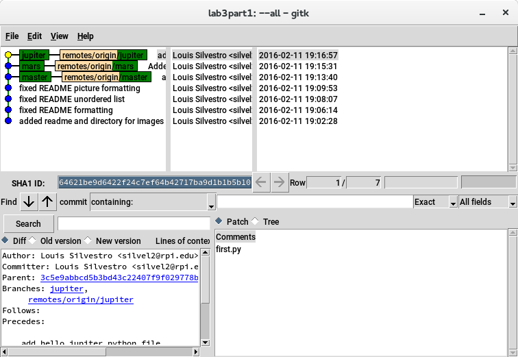

##Lab 3
Part 1:
Repository link: https://github.com/lsilvestro96/lab3part1
gitk: 
git log: 

Part 2:
Link to forked repository: https://github.com/lsilvestro96/Spoon-Knife
Git exercise screenshot:

Part 3:
1. https://github.com/mskmoorthy/spring2016pullreq
2. Using gitk for the spring request repository showed that files were added
   and  
