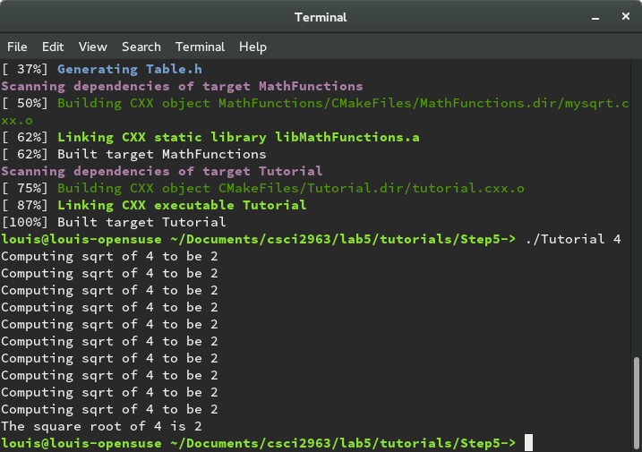

##Lab 5

Step 1:
This first step introduces some basic functionality of cmake, such as
using an h.in file to generate a header file that provides a version number
for the program.


Step2:
This step introduces the use of libraries in a program. It shows how to
configure cmake such that it makes the program use a function defined in
a separate library to compute the square root of a number.


Step 3:
This step demonstrates how to implement install rules and tests to ensure
that the code works as intended. The install rules are defined in the makefile
and can be utilized by typing ```make install```. The tests can be run using
the ```ctest``` command.


Step 4:
This step demonstrates how to instruct cmake to check the capabilities of
the target system and configure the program accordingly. On my machine,
cmake does not detect the log and exp functions, presumably because the
math library for C exists in an architecture-specific directory in which
cmake does not look for libraries.


Step 5:
This step demonstrates how to generate files with cmake. Specifically, cmake
is used to generate a table of square roots for the program to reference. This
is done by making and running a program that generates a header file that
contains the table.




