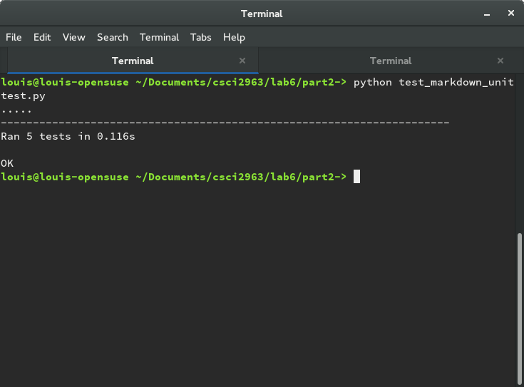

##Lab 6

Part 1:

1. Projects:

Observatory:
* Contributors - 26
* Lines of code - 11592
* First commit - add README (ac21a034bd4085bcf9b87fc44b43a558698e02cf)
* Latest commit - merge pull request (3fbabed34bb1bdd7016f0867e011027382ad72fd)
* Current branches: master, attendence,deployUpdate,small_bugs,projectmodal,
  edit_website

Auto Route:
* The number of contributors: 5
* Number of lines of code: 52,066
* the first commit: Feb 6, 2015
* the latest commit: Feb 29, 2016
* the current branches: master code_duplication robustness tun-server skip_root ping-test-cleanup ping-test update_vendoring fix_autodiscover_test add_race_test check_for_amount refactor_structure add_network_sim vendor

SharpNav
  * Contributors:  10
  * Lines:  53,870 lines
  * First Commit: August 18, 2013
  * Latest Commit: February 7, 2016
  * Current Branches: Master, gh-pages
  
SplitScreen
  * Contributors: 4
  * Lines: 5516 Lines
  * First Commit: September 6, 2015
  * Latest Commit: March 7, 2016
  * Current Brances: Master, DragFix, side-snap

cloudbench
  * 1231 lines total

  * 2 contributors

  * Commit 1: (a062af793fd2cc0ed8fbf1957400b4fe6d8777af) Added description of repository as a readme

  * Commit 38: (62c4fc23bbc7016a0234b15d61f8a6d317f32654) Merged a pull request that added files for static javascript functionality.

  * Branches
    * master
    * copy

    * gh-pages

    * new_ui

    * nodes

    * tmp_branch

2. Gitstats:
   * Observatory: GitStats reports a higher number of contributors, slightly
     less lines of code.
   * SplitScreen: GitStats reported 5 instead of 4 contributors, more lines of
     code, and reported the first commit was made on 9/8/15 instead of 9/6/15
   * Cloudbench: Gitstats data corresponded with data found by hand
   * SharpNav: Gitstats reports 14 vs 10 contributors, less lines of code,
     and reported the first commit was made on 8/21/13 vs 8/18/13
   * Auto-Route: Gitstats

3. Link to gource videos: 
  * [Observatory](https://youtu.be/ylyJ6IYTuEU)
  * [Auto-Route](https://www.youtube.com/watch?v=-fNPgo-nkYM)
  * [SharpNav](https://www.youtube.com/watch?v=_jtZgbA17o0)
  * [CloudBench](https://www.youtube.com/watch?v=TCaG8_DLJsY)
  * [SplitScreen](https://www.youtube.com/watch?v=RsUDFDfWQN0)
  

Part 2:
python file links: [markdown.py](markdown.py) [unittest](test_markdown_unittest.py)

screenshot of test success:

