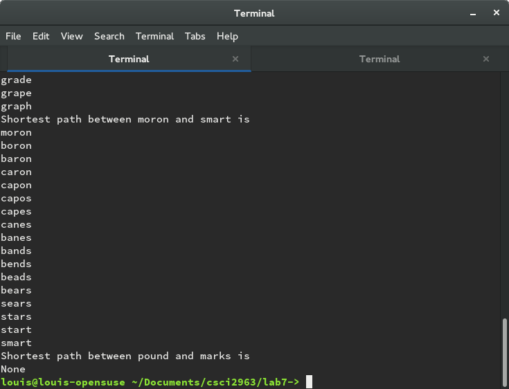
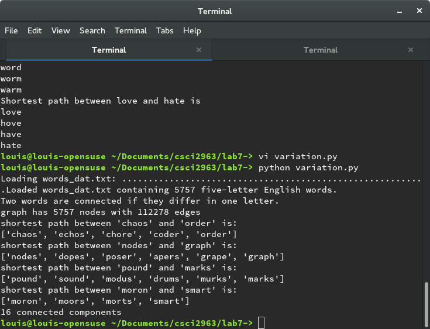

##Louis Silvestro

#Lab7

* Link to word ladder implementation: [word_ladder.py](word_ladder.py)
* Screenshots of 5 letter word solution: 
  
* Screenshot of 4 letter word solution: 
* Link to word ladder variation implementation: [variation.py](variation.py)
* Screenshot of 5 letter word solution for variation: 
* Screenshot of 4 letter word solution for variation: 

Link to the project fork: https://github.com/mattgilman10/butter-desktop
