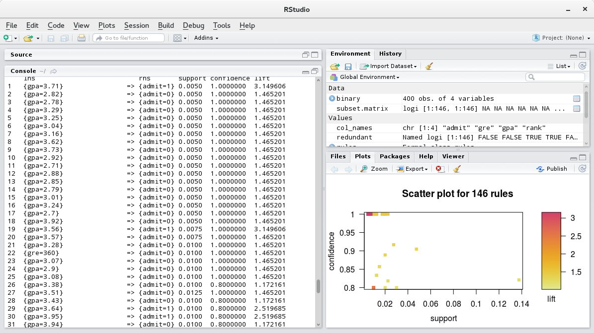
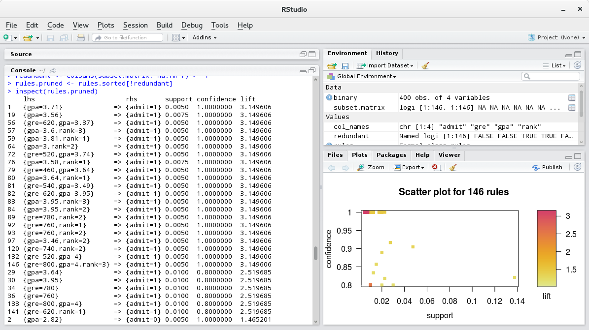
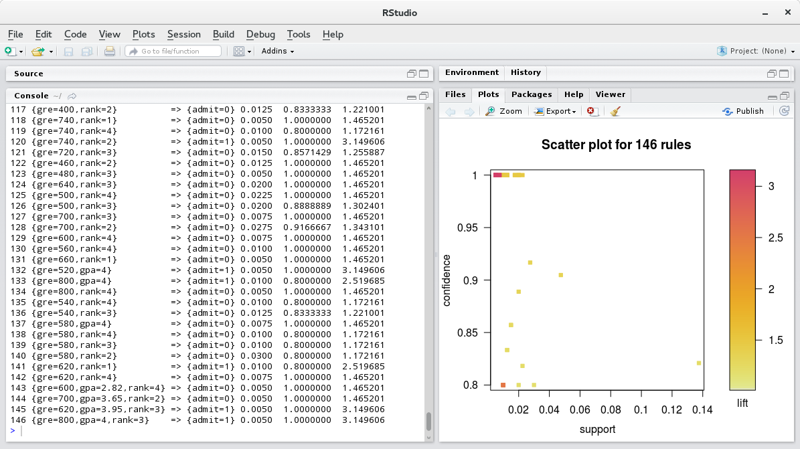

#Lab 8
##Louis Silvestro

* After importing the dataset, I tried running the apriori algorithm with default parameters. This only yielded one rule, so I changed the minimum support to .005, changed the minimum length to 2, and changed the rhs to show whether a student was admitted, which generated 146 rules:

* Then, I sorted the rules in decreasing order of lift:

* Lastly, I plotted the data points using arulesViz and obtained this graph:

Project progress: 
So far, we have a rough timeline for when we want different tasks accomplished. We also have a list of potential issues to work on. One issue that I am planning on fixing is a bug that prevents movies from being sorted by year. I will begin work on resolving this issue over the weekend and will continue to work on it over the coming weeks. If I am able to fix this issue more quickly than anticipated, I will choose another bug to work on.
