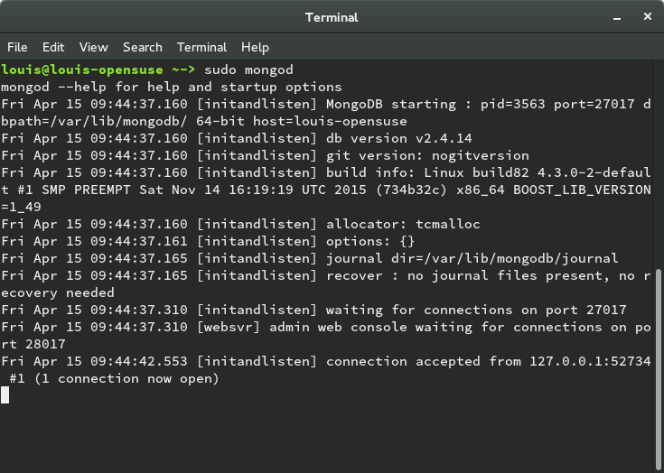
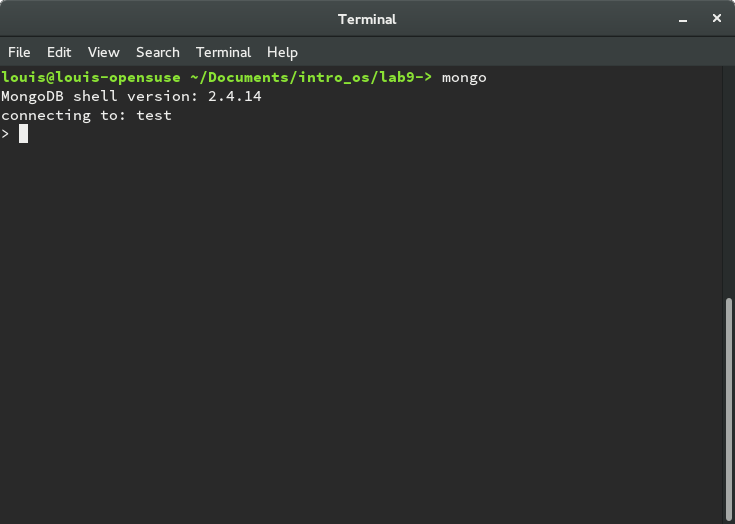
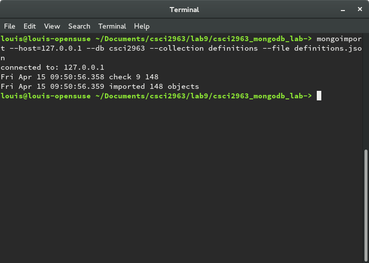
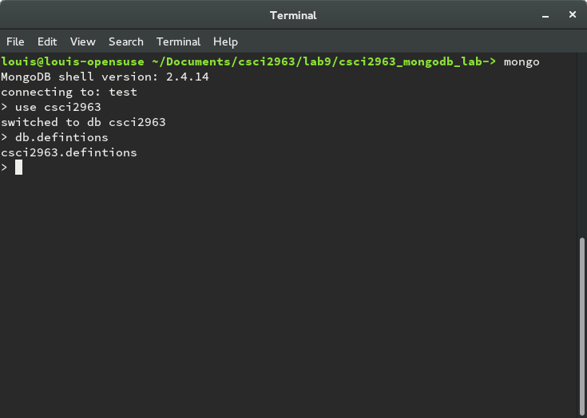
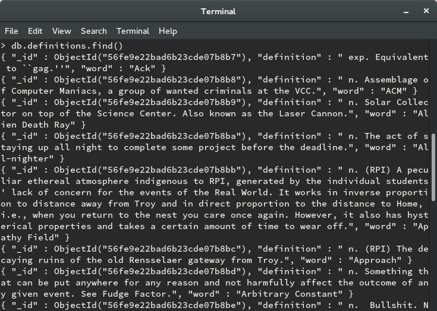
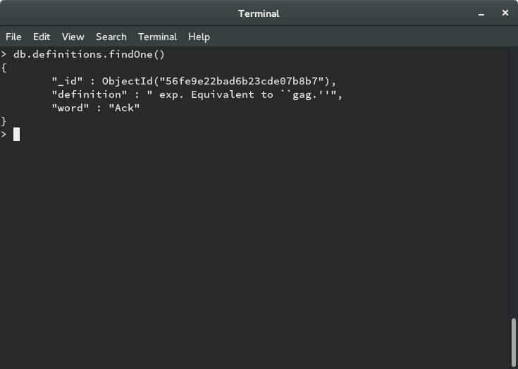
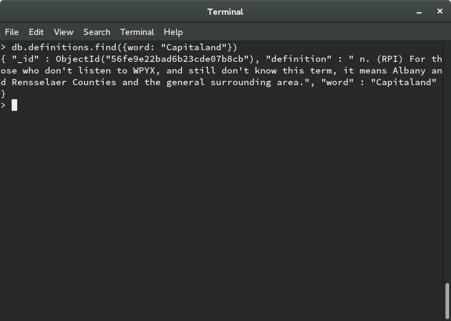
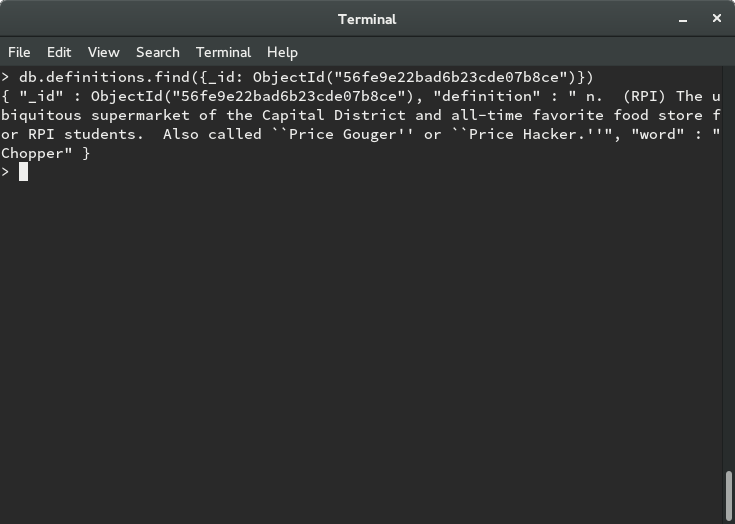
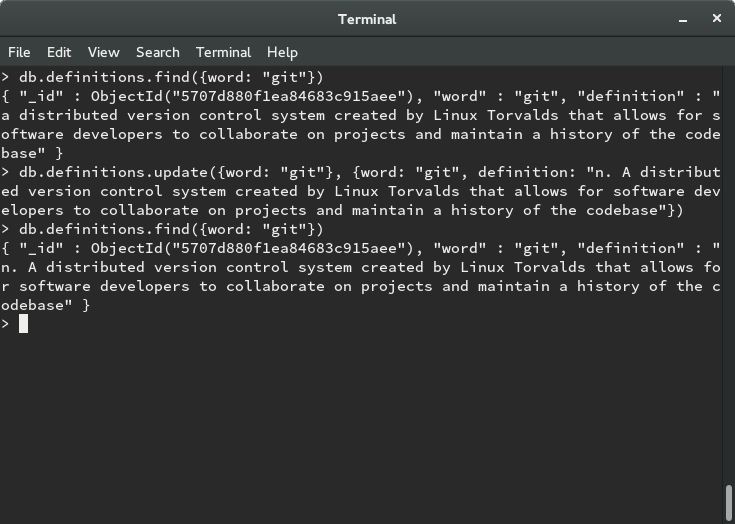
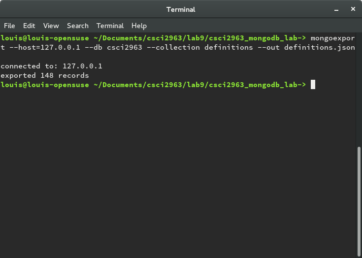

##Lab 9

###Louis Silvestro

1. MongoDB daemon:

   

   MongoDB client:
   
   

2. Import data:

   

3. Basic queries:

   Use database and definitions:

   

   find(): list all documents in the database:

   

   findOne(): list the first document in the database

   

   find({word: "Capitaland"}): display the document with "Capitaland" as the value of the word field

   

   find({_id: ObjectId("56fe9e22bad6b23cde07b8ce")}): find document with specified object id

   

   A definition for git was inserted into the database and updated:

   

   export database to json file:

   

4. Driving Queries

   code of python file: [checkpoint4.py]

5. Random Word Requester

   code: [checkpoint5.py]
